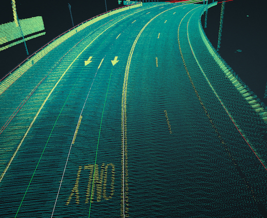
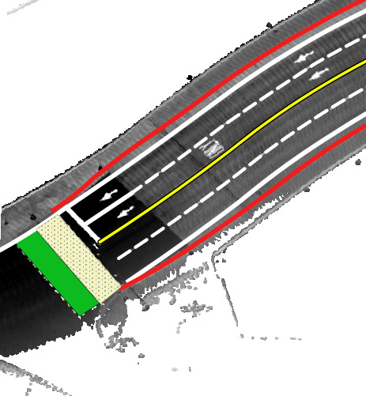
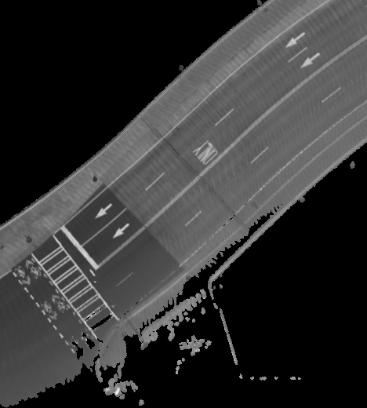

==============
Open Basemap
==============

Open Basemap is a collaborative initiative towards enabling worldwide autonomous vehicle development. More information can be found `here
<https://medium.com/@explorer.ai/open-basemap-dcd9797f3faa>`_.

---------------
Getting Started
---------------
Besides git you will also need to setup git-lfs on your system by following the instructions `here <https://help.github.com/articles/installing-git-large-file-storage/>`_.

------------
Description
------------

Data is represented as a tile of 100 meters x 100 meters. A tile is indexed using the UTM Easting and Northing values in this sample.

3D Map
-------
:Projection: UTM 16N
:Datum: NAD83
:EPSG: 26916

:Sample: |3dmap|

:Format: LAS_, PCD_
.. _LAS: ./sample-tile/740800_3737900/3D/tile.las
.. _PCD: ./sample-tile/740800_3737900/3D/tile.pcd

Semantic Map
-------------
:Projection: WGS84
:Datum: WGS84
:EPSG: 4326

:Sample: |semanticmap|

:Format: GeoJSON_
.. _GeoJSON: ./sample-tile/740800_3737900/semantic/

Features
^^^^^^^^

:Polygon: Bike Crossing, Pedestrian Crossing

:LineString: Road Boundary, Broken White, Double Yellow, Solid White, Stop

:Point List: Waypoints

Rasterized Map
--------------
:Projection: UTM 16N
:Datum: NAD83
:EPSG: 26916

:Sample: |intensityraster|

:Format: `Mean Intensity Geotiff`_, `Ground Only Mean Intensity Geotiff`_
.. _Mean Intensity GeoTiff: ./sample-tile/740800_3737900/raster/mean_intensity.tif
.. _Ground Only Mean Intensity Geotiff: ./sample-tile/740800_3737900/raster/ground_mean_intensity.tif

License
-------
These datasets are licensed under a Creative Commons Attribution-NonCommercial 4.0 International License: https://creativecommons.org/licenses/by-nc/4.0/

Feedback
---------
If you have any suggestions or questions, please reach out at open-basemap@explorer.ai
